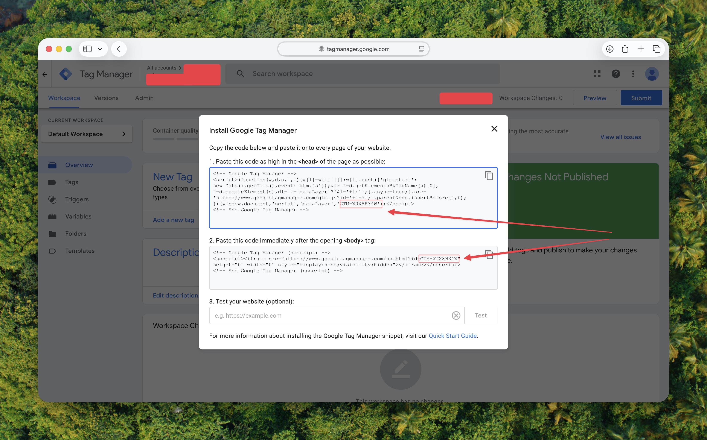

# GTM Setup Plugin for OJS & OMP 3.4

The **GTM Setup Plugin** is a beginner-friendly tool that allows you to integrate Google Tag Manager (GTM) into your Open Journal Systems (OJS) or Open Monograph Press (OMP) website. It eliminates the need to edit core server files and ensures your tracking tags are perfectly placed.

Additionally, this plugin offers an exclusive feature to **track user registrations** (when new users activate their accounts), making it incredibly easy to track successful signups as Conversions in Google Ads.

---

## 🌟 Key Features
1. **No-Code GTM Integration**: Just paste your short "GTM ID" (e.g., `GTM-XXXXXXX`) into the plugin settings. The plugin does the heavy lifting of building and injecting the complex tracking scripts into the correct `<head>` and `<body>` sections of your website.
2. **Bypass Firewall Blocks**: Many plugins fail to save tracking codes because server firewalls (like ModSecurity) flag the raw `<script>` tags as malicious. By only requiring your GTM ID, this plugin is 100% firewall-safe.
3. **Registration Conversion Tracking**: If enabled, the plugin automatically adds `?registrationSuccess=1` to the URL when a user successfully validates their email address, providing a clean, trackable URL for your GTM triggers.
4. **Razorpay Payment Tracking**: Dynamically injects Google Tag Manager and the Data Layer variables directly into the Razorpay `paymentSuccess.tpl` page—tracking successful payments securely.

---

## 📥 How to Install the Plugin

### Method 1: Web Upload (Standard)
1. Download the `gtmSetup.zip` file.
2. Log in to your OJS/OMP dashboard as an Administrator.
3. Navigate to **Settings > Website > Plugins**.
4. Click **Upload A New Plugin** at the top right.
5. Select the `gtmSetup.zip` file and click **Save**.

### Method 2: Manual Upload (Recommended if Method 1 Fails)
> **⚠️ Troubleshooting Note:** If your server uses LiteSpeed, ModSecurity, or strict firewalls, the standard web upload might fail and show a blank screen or a "403 Forbidden / Failed to open stream" error. If this happens, use this manual method:
1. Extract the `gtmSetup.zip` file on your computer. You should get a folder exactly named `gtmSetup`.
2. Log in to your server's **cPanel** (or use FTP) and open the **File Manager**.
3. Navigate to your website's plugin directory: `public_html/plugins/generic/` (or wherever your OJS is installed).
4. Upload the entire `gtmSetup` folder directly into the `generic` directory.
5. Return to your OJS Dashboard > **Settings > Website > Plugins**. The plugin will now appear in the list!

---

## ⚙️ How to Configure GTM

1. Once installed, find **GTM Setup** under the "Generic Plugins" list.
2. Check the box to the right to **Enable** it.
3. Click the blue arrow next to the plugin name and click **Settings**.

### Finding Your GTM ID
You do NOT need to paste the massive block of Google code. You only need your Container ID.
1. Log in to [Google Tag Manager](https://tagmanager.google.com/).
2. Click on your Workspace ID at the top right (it starts with `GTM-`).
3. A window will pop up showing the installation code. Look for the short ID shown in the red box in the image below, and copy it.

4. Paste this ID into the **Google Tag Manager ID** field in the plugin settings and click Save.

---

## 📈 Setting Up Registration Tracking (Optional)

If you are running Google Ads and want to track how many people register for your journal:
1. Check the box for **Enable User Registration Tracking** in the plugin settings.
2. Go to your Google Tag Manager dashboard.
3. Create a new **Trigger** with the following settings:
   - **Trigger Type**: Page View
   - **This trigger fires on**: Some Page Views
   - **Fire Condition**: `Page URL` > `contains` > `registrationSuccess=1`
4. Attach this trigger to your Google Ads Conversion Tracking Tag. 

Your journal will now report successful registrations directly to Google Ads!

---

## 💳 Setting Up Payment Success Tracking

If you are using the Razorpay plugin and wish to track payment conversions directly into Google Ads:
1. Ensure the **Enable Payment Success Tracking** checkbox is checked in the plugin settings.
2. In Google Tag Manager, create a new **Custom Event** Trigger with the exact Event Name: `payment_success`.
3. Optionally, create **Data Layer Variables** in GTM to capture `transaction_id`, `order_id`, and `submission_id`.
4. Link this trigger to your Google Ads Conversion tag. The plugin will automatically parse and inject the `{literal}` GTM tags securely on the payment completion page.
